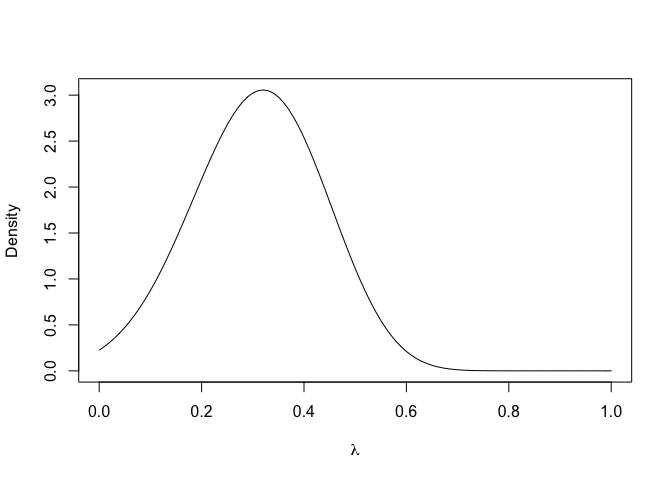

<!-- README.md is generated from README.Rmd. Please edit that file -->

# truelies

[](https://cran.r-project.org/package=truelies)
[](https://ci.appveyor.com/project/hughjonesd/truelies)

`truelies` implements Bayesian methods, described in [Hugh-Jones
(2019)](https://link.springer.com/article/10.1007/s40881-019-00069-x),
for estimating the proportion of liars in coinflip-style experiments,
where subjects report a random outcome and are paid for reporting a
“good” outcome.

For R source for the original paper, see
<https://github.com/hughjonesd/GSV-comment>.

## Installation

``` r
# stable version on CRAN
install.packages("truelies")

# latest version from github
remotes::install_github("hughjonesd/truelies")
```

## Example

If you have 33 out of 50 reports of heads in a coin flip experiment:

``` r
library(truelies)
d1 <- update_prior(heads = 33, N = 50, P = 0.5, prior = dunif)
plot(d1)
```



``` r
dist_mean(d1)
#> [1] 0.3120336

# 95% confidence interval, using hdrcde
dist_hdr(d1, 0.95)
#> [1] 0.06122615 0.55000081
```

## Citation

Hugh-Jones D (2019). “True Lies: Comment on Garbarino, Slonim and
Villeval (2018).” *Journal of the Economic Science Association*. doi:
10.1007/s40881-019-00069-x (URL:
<https://doi.org/10.1007/s40881-019-00069-x>), &lt;URL:
<https://link.springer.com/article/10.1007/s40881-019-00069-x>&gt;.

## Bibtex

    @Article{hughjones2019,
      title = {True Lies: Comment on Garbarino, Slonim and Villeval (2018)},
      author = {David Hugh-Jones},
      journal = {Journal of the Economic Science Association},
      year = {2019},
      url = {https://link.springer.com/article/10.1007/s40881-019-00069-x},
      doi = {10.1007/s40881-019-00069-x},
    }
